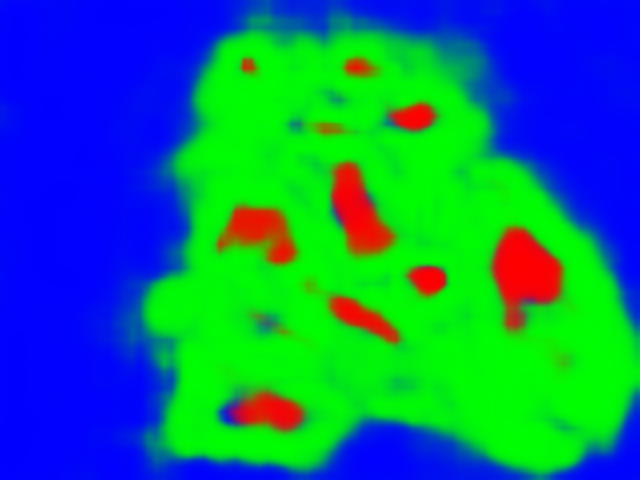
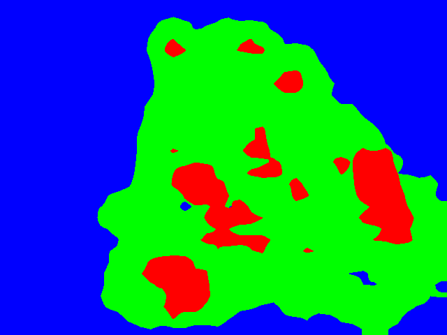

###  **This repo is to evaluate inference speed of RGANet and other segmentation algorithms on Suction Dataset and present their qualitative results. Official RGANet codes can be found** [here](https://github.com/dunknowcoding/RGANet.git).

## Dataset
* Download [Suction dataset](http://arc.cs.princeton.edu)
```
wget http://vision.princeton.edu/projects/2017/arc/downloads/suction-based-grasping-dataset.zip
unzip suction-based-grasping-dataset.zip # unzip dataset
```
## Requirements
* python dependencies
```
pip install -r requirements.txt
```
* apex
```
git clone clone https://github.com/NVIDIA/apex.git
cd apex
python setup.py install
```
* inplace_abn
```
git clone https://github.com/mapillary/inplace_abn.git
cd inplace_abn
python setup.py install
```
* CatConv2d
```
cd ./networks/hardnet/CatConv2d
python setup.py install
```
## Evaluation
* Download checkpoints from [link](https://drive.google.com/file/d/12cfo5IRFptFk-FcnJxc6cXBqE-Gf1FyE/view?usp=sharing)
* Revise ```DATA_PATH``` and ```CHECKPOINT_PATH``` in ```run_test.sh``` to your directories.
* Run test script.
```
sh run_test.sh
```

## Speed Test Results
Below are our results on v100.
### 1. Compared with larger models
#### 1.1 Inference Speed

| method - backbone     | params (m) | MACs(G) | time/image (ms)     |  
|-----------------------|------------|---------|---------------------|
| ccnet                 | 71.271     | 365.174 | 51.0275             |
| fcn - resnet50        | 32.948     | 162.419 | 22.8495             |
| fcn - resnet101       | 51.94      | 253.581 | 39.4119             |
| deeplab - resnet50    | 39.634     | 192.005 | 32.7095             |
| deeplab - resnet101   | 58.626     | 283.168 | 49.1682             | 
| **RGA_NB (ours)**     | 3.413      | 7.854   | 7.5080              |

#### 1.2 Visualization
|                       | 000009-0 | 000044-0 | 000574-1 | 001164-1 | 000304-0 | 000764-1 |
|-----------------------|--------|--------|--------|--------|--------|--------|
| color input           | |  |   |   |        |        |
| ground truth          | |  |   |   |        |        |
| CCNet                 |         |      |       |        |       |        |
| fcn - resnet50        |  |  || || |
| fcn - resnet101       | | ||  ||  |
| deeplab - resnet50    |  |  |  |  |  |  |
| deeplab - resnet101    |  |  |  |  |  |  |
| BiSeNetv1              |         |      |       |        |       |        |
| **RGA_NB (ours)**      |    |  |      |        |      |        |


### 2. Compared with smaller models
#### 2.1 Inference Speed
| method - backbone     | params (m) | MACs(G) | time/image (ms)     |  
|-----------------------|------------|---------|---------------------|
| deeplab - mobilenetv2 | 4.119      | 5.786   | 2.9170              |
| DDRNet-23-slim        | 5.6949     | 5.350   | 1.2294              |
| HRnet-w18-small-v1    | 1.5370     | 4.873   | 1.8449              |
| HarDNet               | 4.1185     | 5.165   | 1.6298              |
| ShelfNet18            | 14.5731    | 14.590  | 2.0605              |
| STDC1                 | 14.232     | 27.422  | 2.4507              |
| **RGA_NB (ours)**     | 3.413      | 7.854   | 7.5080              |

#### 2.2 Visualization
|                       | 000009-0 | 000044-0 | 000574-1 | 001164-1 | 000304-0 | 000764-1 |
|-----------------------|--------|--------|--------|--------|--------|--------|
| color input           | |  |   |   |        |        |
| ground truth          | |  |   |   |        |        |
| deeplabv3 mobilenetv2 | |    |       |        |       |        |
| DDRNet-23-slim        | | ||  ||  |
| HRnet-w18-small-v1    |  |  |  |  |  |  |
| HarDNet               |  |  |  |  |  |  |
| ShelfNet18            |  |  |  |  |  |  |
| STDC1                 |  |  |  |  |  |  |
| **RGA_NB (ours)**      |    |  |      |        |      |        |


## Reference
* [1] Huang, Zilong, et al. "Ccnet: Criss-cross attention for semantic segmentation." Proceedings of the IEEE/CVF International Conference on Computer Vision. 2019. [code reference](https://github.com/Serge-weihao/CCNet-Pure-Pytorch)
* [2] Chen, Liang-Chieh, et al. "Rethinking atrous convolution for semantic image segmentation." arXiv preprint arXiv:1706.05587 (2017). [code reference](https://github.com/zym1119/DeepLabv3_MobileNetv2_PyTorch)
* [3] Sandler, Mark, et al. "Mobilenetv2: Inverted residuals and linear bottlenecks." Proceedings of the IEEE conference on computer vision and pattern recognition. 2018.
* [4] Wang, Jingdong, et al. "Deep high-resolution representation learning for visual recognition." IEEE transactions on pattern analysis and machine intelligence (2020). [official code](https://github.com/xiangyu8/suction_based_grasping_segmentation/tree/1d58b3eeecce7b10aeca504383bfd81731da3bdd/HRNet-Semantic-Segmentation)
* [5] Chao, Ping, et al. "Hardnet: A low memory traffic network." Proceedings of the IEEE/CVF International Conference on Computer Vision. 2019. [official code](https://github.com/PingoLH/Pytorch-HarDNet)
* [6] Zhuang, Juntang, et al. "Shelfnet for fast semantic segmentation." Proceedings of the IEEE/CVF International Conference on Computer Vision Workshops. 2019.[official code](https://github.com/juntang-zhuang/ShelfNet)
* [7] Fan, Mingyuan, et al. "Rethinking BiSeNet For Real-time Semantic Segmentation." Proceedings of the IEEE/CVF Conference on Computer Vision and Pattern Recognition. 2021. [official code](https://github.com/MichaelFan01/STDC-Seg)
* [8] Hong, Yuanduo, et al. "Deep dual-resolution networks for real-time and accurate semantic segmentation of road scenes." arXiv preprint arXiv:2101.06085 (2021). [official code](https://github.com/ydhongHIT/DDRNet)
* [9] Howard, Andrew, et al. "Searching for mobilenetv3." Proceedings of the IEEE/CVF International Conference on Computer Vision. 2019.
* [10] Yu, Changqian, et al. "Bisenet: Bilateral segmentation network for real-time semantic segmentation." Proceedings of the European conference on computer vision (ECCV). 2018.
